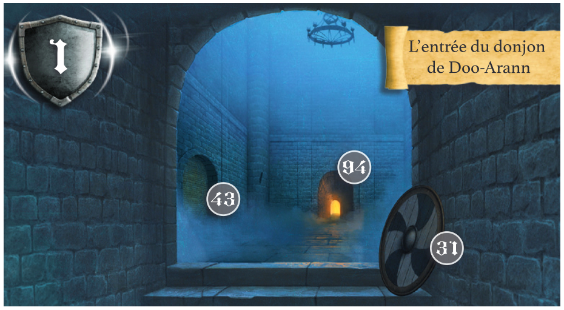
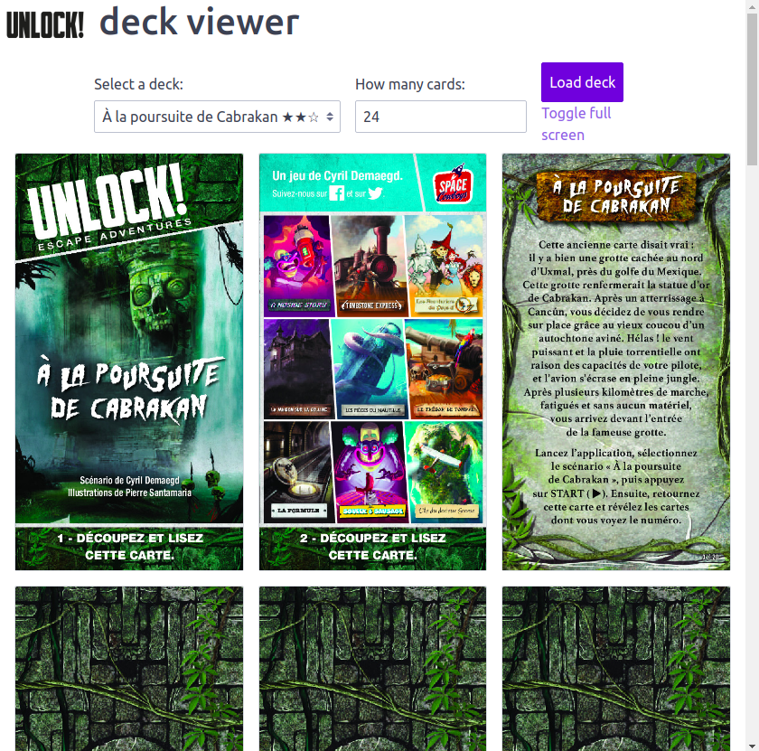

# unlock-deck-viewer

1. Find your next Unlock adventure deck on https://www.spacecowboys.fr/unlock-demos
2. Choose the deck on the application
3. Flip cards, zoom and enjoy!

  

## Installation

    git clone https://github.com/sophietk/unlock-deck-viewer.git
    cd unlock-deck-viewer
    npm i

Ensure you have `convert`, `gs`, and `pdfinfo` (part of poppler) commands.

### Linux

    sudo apt install imagemagick ghostscript poppler-utils

If you get a `unable to open file` error, please check that the ImageMagick policy is well set for PDF files:
- edit file `/etc/ImageMagick-7/policy.xml`
- replace rights in line `<policy domain="coder" rights="none" pattern="PDF" />` by `read|write` instead of `none`.

### Mac OS

    brew install imagemagick ghostscript poppler

## Usage

    npm start

And go to http://localhost:4000
