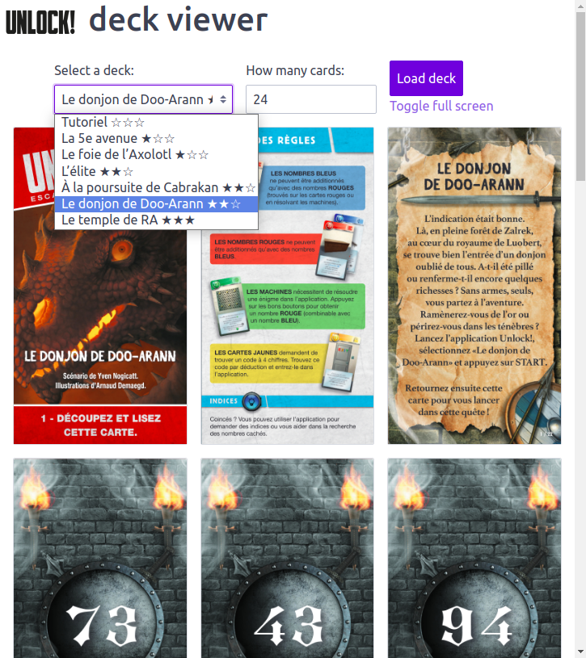
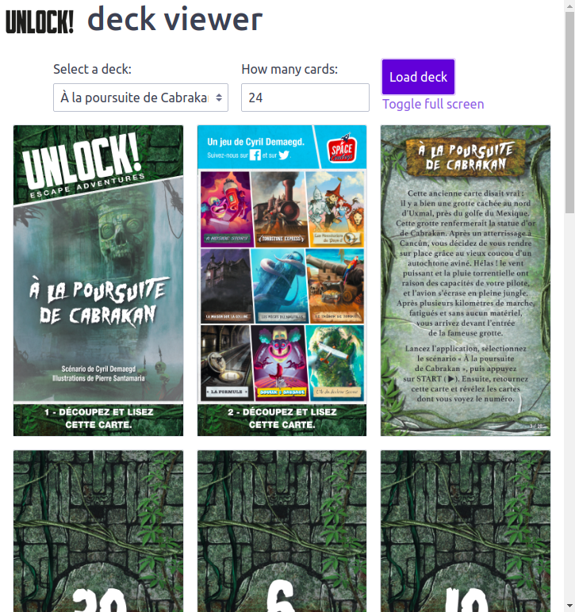

# unlock-deck-viewer


1. Find your next Unlock adventure deck on https://www.spacecowboys.fr/unlock-demos
2. Choose the deck on the application
3. Flip cards, zoom and enjoy!

  


## Installation

```bash
npm i -g unlock-deck-viewer
```

## Usage

```bash
unlock-deck-viewer
```

And go playing on http://localhost:4000

Options:
```
-p, --app-port <number>  set app port (default: 4000)
-i, --api-port <number>  set api port (default: 3000)
-h, --help               display help for command
```
